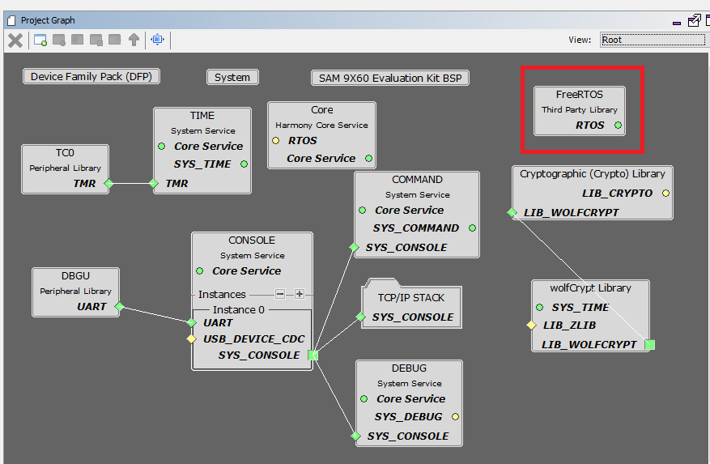
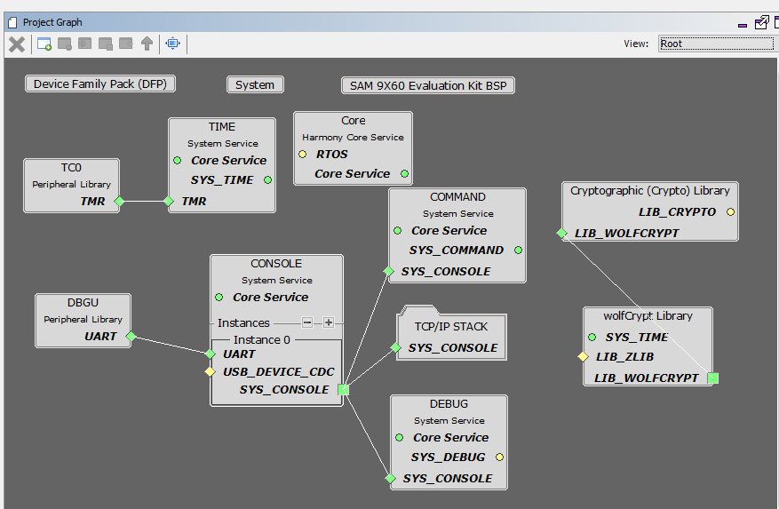
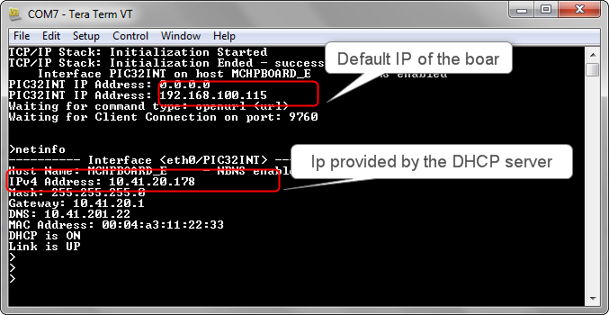

# TCP/IP TCP Berkeley Client

The TCP Berkeley Client configuration demonstrates creating a network client with the MPLAB Harmony TCP API to make a TCP/IP connection to a web server.

**TCP/IP TCP Berkeley Client MHC Configuration**

The following Project Graph diagram shows the Harmony components included in the TCP Berkeley Client demonstration application.

-   MHC is launched by selecting **Tools \> Embedded \> MPLAB® Harmony 3 Configurator** from the MPLAB X IDE and after successful database migration , TCP/IP demo project is ready to be configured and regenerated.

    

-   **TCP/IP Root Layer Project Graph**

    The root layer project shows that DBGU UART peripheral is selected to do read and write operation for TCP/IP commands.

    This is the basic configuration with SYS\_CONSOLE, SYS\_DEBUG and SYS\_COMMAND modules. These modules are required for TCP/IP command execution.

    

    **FreeRTOS** component is required for RTOS application. For bare-metal \(non-RTOS\) **FreeRTOS** component should not be selected.

    **NOTE** - The above diagram contains **FreeRTOS** component and that is required for RTOS application. For bare-metal\(non-RTOS\) **FreeRTOS** component shouldn't be selected.

    

    TCP sockets calculate the ISN using the wolfSSL crypto library.

-   **TCP/IP Required Application**

    TCP/IP demo use these application module components for this demo.

    **Announce** module to discover the Microchip devices within a local network.

    **DHCP Client** module to discover the IPv4 address from the nearest DHCP Server.

    **DNS Client** provides DNS resolution capabilities to the stack.

    

-   **TCPIP Driver Layer**

    **Internal ethernet driver\(emac0\)** is enabled with the external **KSZ8081 PHY driver** library for SAM9X60 demonstartion.

    

    The MIIM Driver supports asynchronous read/write and scan operations for accessing the external PHY registers and notification when MIIM operations have completed.

**TCP/IP TCP Berkeley Client Hardware Configuration**

This section describes the hardware configuration for ATSAM 9X60 Xplained Ultra Evaluation Kit and one can be used for the respective application demonstration.

1.  This section describes the required default hardware configuration use SAM 9X60 Xplained Ultra Evaluation Kit

    -   Refer to the SAM 9X60 Xplained Ultra Evaluation Kit [User Guide](https://ww1.microchip.com/downloads/en/DeviceDoc/SAM9X60-EK-UG-DS50002907B.pdf)

    

    • Insert the SD Card with the "harmony.bin" output of the project into the SD card slot, J5

    • Connect the board to a USB port on the test PC by inserting the serial cable into the serial connector, J24

    • For debugging insert the Atmel SAM-ICE debugger to the JTAG port, J23

    • Connect the micro USB cable from the computer to the USB Power connector on the SAM9X60-EK to power the board, J22

    • Establish a connection between the router/switch with the SAM9X60-EK through the RJ45 connector

**TCP/IP TCP Berkeley Client Running Application**

This table list the name and location of the MPLAB X IDE project folder for the demonstration.

|Project Name|Target Device|Target Development Board|Description|
|------------|-------------|------------------------|-----------|
|sam\_9x60\_ek\_mplabx.X|SAM 9X60|SAM9X60 Xplained Ultra + KSZ8081 PHY Daughter board|Demonstrates the TCP/IP TCP Berkeley Client on development board with SAM9X60 device and an on-board KSZ8081 PHY. This is a bare-metal \(non-RTOS\) implementation|
|sam\_9x60\_ek\_freertos\_mplabx.X|SAM 9X60|SAM9X60 Xplained Ultra + KSZ8081 PHY Daughter board|Demonstrates the TCP/IP TCP Berkeley Client on development board with SAM9X60 device and an on-board KSZ8081 PHY. This implementation is based on FreeRTOS|

1.  Build the demo by opening the project in the MPLAB X IDE

2.  Copy the project output, harmony.bin, to the SD card that is used to load the executable and run it on the SAM9X60-EK board. Note: the boot loader on the SD card, boot.bin, should be configured to load the harmony.bin image, not a uboot.bin image.

**Running Demonstration Steps**

1.  Build and download the demonstration project on the target board.

2.  If the board has a UART connection:

    1.  A virtual COM port will be detected on the computer, when the USB cable is connected to USB-UART connector.

    2.  Open a standard terminal application on the computer \(like Hyper-terminal or Tera Term\) and configure the virtual COM port.

    3.  Set the serial baud rate to 115200 baud in the terminal application.

    4.  Insert the SD card into J5 on the SAM 9X60 board and press the reset button which is labeled ‘SW3’ on the silkscreen. At this moment the board should boot and display messages on the terminal console.

    5.  See that the initialization prints on the serial port terminal.

    6.  When the DHCP client is enabled in the demonstration, wait for the DHCP server to assign an IP address for the development board. This will be printed on the serial port terminal.

        -   Alternatively: Use the Announce service or ping to get the IP address of the board.

        -   Run **tcpip\_discoverer.jar** to discover the IPv4 and IPv6 address for the board.

3.  Execution :

    1.  After the successful broad bring up, the console output becomes

        

    2.  For TCP Berkeley Client test, input the following command from the serial port:

        **openurl < url \>** - The < url \> argument must be a fully formed URL; for instance, http://www.microchip.com/.

        For this above URL , the DNS module will make a DNS query. Then it will open a connection to the requested URL and perform a simple HTTP GET command.

        The response received from the server will be printed on the terminal application through the serial port.

        The expected output -

        

**Parent topic:**[MPLAB® Harmony 3 TCP/IP Application for SAM 9X60 Family](../../docs/GUID-E9DE90C9-151B-4975-A6F1-B20C092FDE6A.md)

