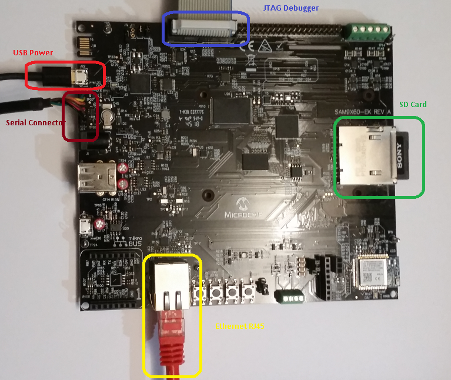

# TCP/IP Web Net Server QSPI MPFS Hardware Configuration

This is the section describes the hardware configuration for ATSAM 9X60 Xplained Ultra Evaluation Kit and one can be used for the respective application demonstration.

1. This section describes the required default hardware configuration use SAM 9X60 Xplained Ultra Evaluation Kit

    * Refer to the SAM 9X60 Xplained Ultra Evaluation Kit [User Guide](https://ww1.microchip.com/downloads/en/DeviceDoc/SAM9X60-EK-UG-DS50002907B.pdf)

      

      • Insert the SD Card with the "harmony.bin" output of the project into the SD card slot, J5 

      • Connect the board to a USB port on the test PC by inserting the serial cable into the serial connector, J24 

      • For debugging insert the Atmel SAM-ICE debugger to the JTAG port, J23   
      
      • Connect the micro USB cable from the computer to the USB Power connector on the SAM9X60-EK to power the board, J22 
      
      •  Establish a connection between the router/switch with the SAM9X60-EK through the RJ45 connector

      