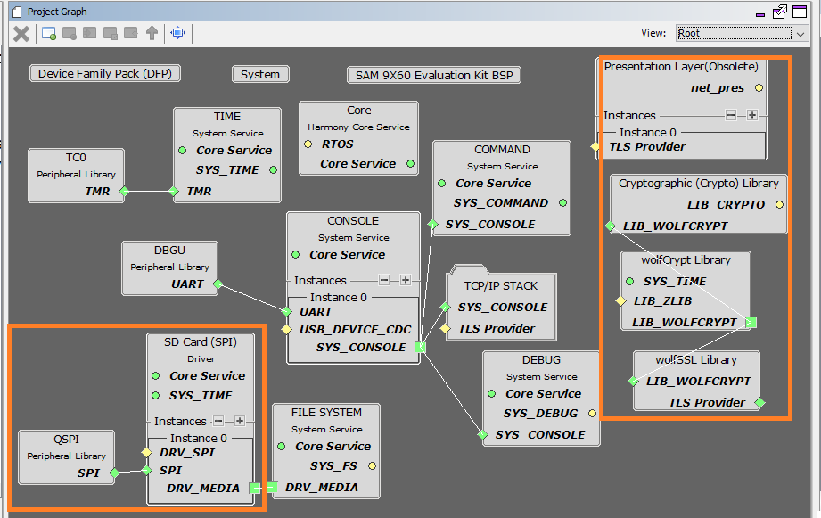

# TCP/IP Web NET Server QSPI MPFS MHC Configuration

The following Project Graph diagram shows the Harmony components included in the application demonstration.

* MHC is launched by selecting **Tools > Embedded > MPLAB® Harmony 3 Configurator** from the MPLAB X IDE and after successful database migration , TCP/IP demo project is ready to be configured and regenerated.

    

* **TCP/IP root layer project graph**

  The root layer project shows that DBUG UART peripheral is selected to do read and write operation for TCP/IP commands.

  This is the basic configuration with SYS_CONSOLE, SYS_DEBUG and SYS_COMMAND modules. These modules are required for TCP/IP command execution.

  
  
  **WolfSSL** component is selected for secure connection which supports TLS v1.3 and **WolfSSL-Crypto** component is  selected for MD5 and SHA authentication.

  

  The file system component is required to select MPFS module. This is the below snapshot for the FS configuration.

  

  **FreeRTOS** component is required for RTOS application. For bare-metal (non-RTOS) **FreeRTOS** component should not be selected.

  TCP sockets calculate the ISN using the wolfSSL crypto library. 

* **TCP/IP Required Application**

    TCP/IP demo use these application module components for this demo.
    
    **Announce** module to discover the Microchip devices within a local network.

    **DHCP Client** module to discover the IPv4 address from the nearest DHCP Server. 
    
    **HTTPNET** module is selected to run the web_server for the secured port number **443**.
     
    

    By default **Enable MPFS upload via HTTP** is selected. This is helpful When external EEPROM or serial Flash is used for storage, the option to upload the newly created image to the board is available.
    
* **TCPIP Driver Layer**

  **Internal ethernet driver(emac0)** is enabled with the external **KSZ8081 PHY driver** library for SAM9X60 demonstartion. 

  

   The MIIM Driver supports asynchronous read/write and scan operations for accessing the external PHY registers and notification when MIIM operations have completed.
