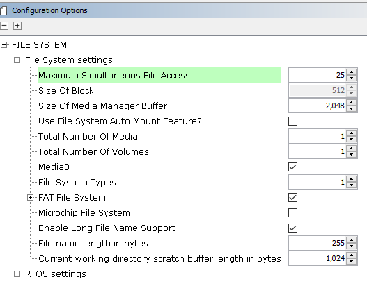

# TCP/IP Web NET Server SDCARD FATFS MHC Configuration

The following Project Graph diagram shows the Harmony components included in the application demonstration.

* MHC is launched by selecting **Tools > Embedded > MPLAB® Harmony 3 Configurator** from the MPLAB X IDE and after successful database migration , TCP/IP demo project is ready to be configured and regenerated.

    

* **TCP/IP root layer project graph**

    QSPI peripheral with SDSPI driver supports Multimedia card communication. SD SPI driver provides abstraction to communicate with SD/eMMC card through the QSPI peripheral library interface. The TCP/IP application use FAT file system with SDSPI driver to read/write to/from an SD card. 

    

    **WolfSSL** component is selected for secure connection which supports TLS v1.3 and **WolfSSL-Crypto** component is  selected for MD5 and SHA authentication.

    

    **Wolfssl crypto** module enabled with MD5,SHA authentication. Wolfssl library configured with open secured socket.

    **FreeRTOS** component is required for RTOS application. For bare-metal (non-RTOS) **FreeRTOS** component should not be selected.

    The FAT file system is selected for this application to read and write from the SDHC( sdcard ) module. This is the below snapshot for the FAT FS configuration.

    

    TCP sockets calculate the ISN using the wolfSSL crypto library. 

* **TCP/IP required application**

    TCP/IP demo use these application module components for this demo. 
    
    **Announce** module to discover the Microchip devices within a local network.
    
    **DHCP Client** module to discover the IPv4 address from the nearest DHCP Server. 
    
    **HTTPNET** module is selected to run the web_server for the port number **443**.     

    

* **TCPIP driver layer**

  **Internal ethernet driver(emac0)** is enabled with the external **KSZ8081 PHY driver** library for SAM9X60 demonstartion. 

  

  
  The MIIM Driver supports asynchronous read/write and scan operations for accessing the external PHY registers and notification when MIIM operations have completed.
