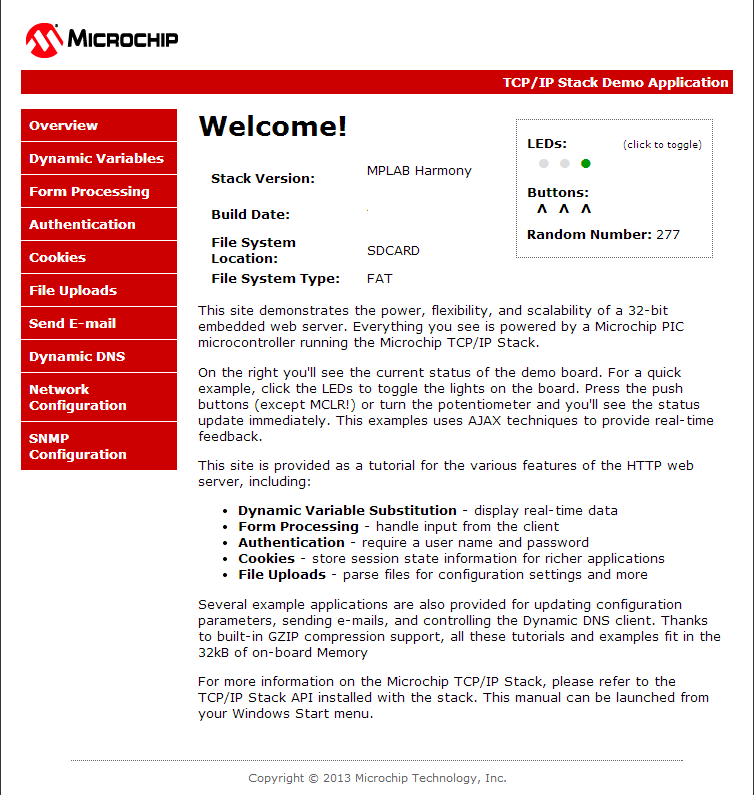

# TCP/IP Web NET Server SDCARD FATFS Running Application
This Web Net Server application uses the SD card as a memory media and reads the web pages stored according to the configured mount path. Web Server reads the external SD card content using FAT FS API.

## IAR Embeded Workbench IDE Project

This table lists the name and location of the IAR IDE project folder for the demonstration. 

|Project Name|  Target Device|  Target Development Board | Description  |
|:-------------:|:---------:|:---------:|:---------:|
|sam_9x60_ek.IAR | SAM 9X60  | SAM9X60 Xplained Ultra + KSZ8081 PHY Daughter board | Demonstrates the TCP/IP Web net server on development board with SAM9X60 device using SDSPI driver with QSPi peripheral and an on-board KSZ8081 PHY. This is a bare-metal (non-RTOS) implementation  |

## Running The Demonstration

1. Build the demo by opening the project in the IAR Embedded Workbench 

2. Copy the project output, harmony.bin, to the SD card that is used to load the executable and run it on the SAM9X60-EK board. Note: the boot loader on the SD card, boot.bin, should be configured to load the **harmony.bin** image, not a **uboot.bin** image. 

3. Configure the Development Board as given  **[Configure Hardware](readme_hardware_configuration.md)**.

4. Make the demonstration setup as shown [Network Setup](../../readme.md).

5. Build and download the demonstration project on the target board.

6. If the board has a UART connection:

    1. A virtual COM port will be detected on the computer, when the USB cable is connected to USB-UART connector.

    2. Open a standard terminal application on the computer (like Hyper-terminal or Tera Term) and configure the virtual COM port.

    3. Set the serial baud rate to 115200 baud in the terminal application.

    4. Insert the SD card into J5 on the SAM 9X60 board and press the reset button which is labeled ‘SW3’ on the silkscreen. At this moment the board should boot and display messages on the terminal console. 

    5. See that the initialization prints on the serial port terminal.

    6. When the DHCP client is enabled in the demonstration, wait for the DHCP server to assign an IP address for the development board. This will be printed on the serial port terminal.

		* Alternatively: Use the Announce service or ping to get the IP address of the board.

        * Run **tcpip_discoverer.jar** to discover the IPv4 and IPv6 address for the board.
        
7. Execution :

    An HTTP server is hosted by the demonstration application. Open_a web browser and direct it to the board running the HTTP server by typing the URL in the address bar (for example, https://mchpboard_c), and then pressing Enter. 

    The demonstration application features following: 

    Real-time Hardware Control and Dynamic Variables - On the Overview page the LEDs can be clicked to toggle the LEDs on the Microchip hardware development board. The SWITCHes on the Microchip hardware development board can be pressed to toggle the Buttons on the web page. The dynamic variables can be updated in real-time on the HTTP server. 

    **Note:**  For the LED and SWITCH functionality portion of the demonstration, configure the GPIOs connected to LEDs and Switches on Microchip hardware development board, through the Pin Configuration manager in MPLAB® Harmony Configurator (MHC).  

    1. **Form Processing** - Input can be handled from the client by using the GET and POST methods (this functionality controls the on-board LEDs and is operational only on the Explorer 16 Development Board)

    2. **Authentication** - Shows an example of the commonly used restricted access feature 
    
    3. **Cookies** - Shows an example of storing small text strings on the client side 

    4. **Server Side Includes** - An example of how SSI can be used to support dynamic content 

    5. **File Uploads** - Shows an example of a file upload using the POST method. The HTTP server can_accept_a user-defined MPFS/MPFS2 image file for web pages. 
    
    6. **Send E-mail** - Shows simple SMTP POST methods 

    7. **Dynamic DNS** - Exercises Dynamic DNS capabilities 
    
    8. **Network Configuration** - The MAC address, host name, and IP address of the evaluation kit can be viewed in the Network Configuration page and some configurations can be updated 
    
    9. **MPFS Upload** - A new set of web pages can be uploaded to the web server using this feature, which is accessed through http://mchpboard_c/mpfsupload 

   
   
