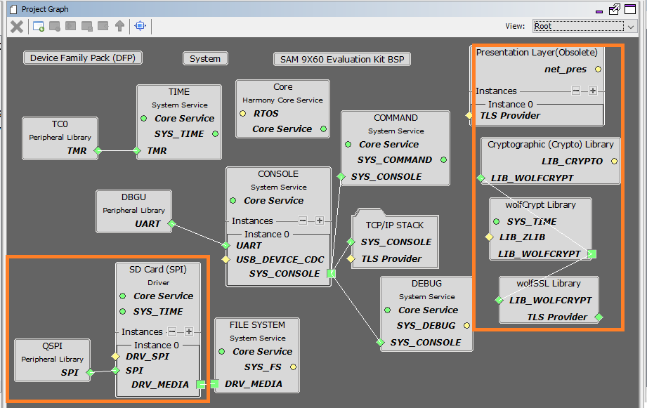
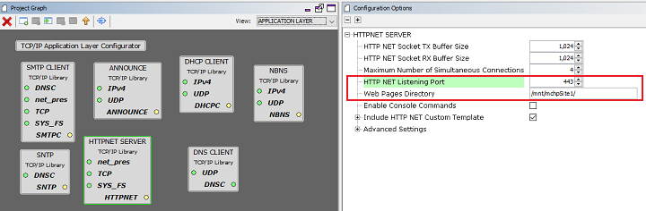
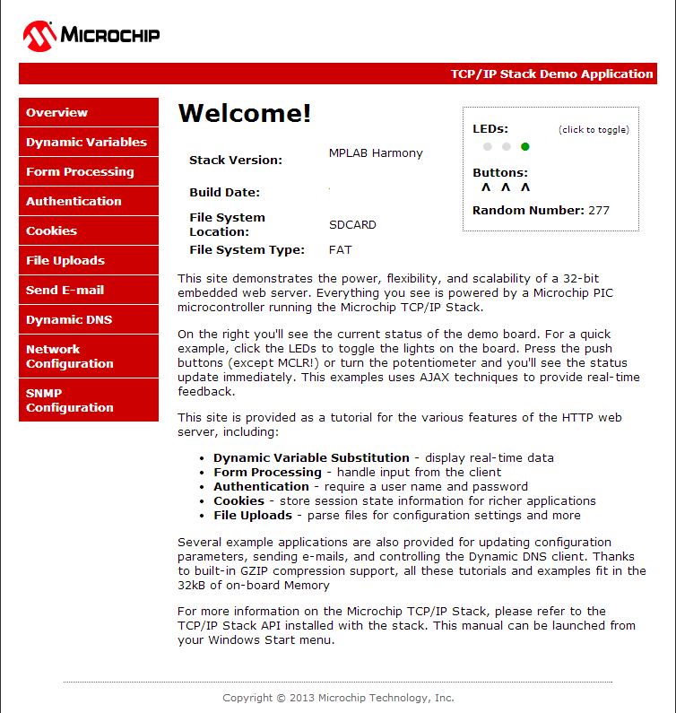

# TCP/IP WEB-NET Server SDMMC Application

The Web Net Server SDCard configuration demonstrates creating an HTTP web server on a Microchip evaluation board. The FAT FS File System is used for storing the web pages on an external SD Card.

This demonstration uses the HTTP\_NET server which supports encrypted communication through the NET\_PRES layer and an external service provider for TLS support.

**TCP/IP Web NET Server SDCARD FATFS MHC Configuration**

The following Project Graph diagram shows the Harmony components included in the application demonstration.

-   MHC is launched by selecting **Tools \> Embedded \> MPLAB® Harmony 3 Configurator** from the MPLAB X IDE and after successful database migration , TCP/IP demo project is ready to be configured and regenerated.

    

-   **TCP/IP root layer project graph**

    QSPI peripheral with SDSPI driver supports Multimedia card communication. SD SPI driver provides abstraction to communicate with SD/eMMC card through the QSPI peripheral library interface. The TCP/IP application use FAT file system with SDSPI driver to read/write to/from an SD card.

    

    **WolfSSL** component is selected for secure connection which supports TLS v1.3 and **WolfSSL-Crypto** component is selected for MD5 and SHA authentication.

    

    **Wolfssl crypto** module enabled with MD5,SHA authentication. Wolfssl library configured with open secured socket.

    **FreeRTOS** component is required for RTOS application. For bare-metal \(non-RTOS\) **FreeRTOS** component should not be selected.

    The FAT file system is selected for this application to read and write from the SDHC\( sdcard \) module. This is the below snapshot for the FAT FS configuration.

    

    TCP sockets calculate the ISN using the wolfSSL crypto library.

-   **TCP/IP required application**

    TCP/IP demo use these application module components for this demo.

    **Announce** module to discover the Microchip devices within a local network.

    **DHCP Client** module to discover the IPv4 address from the nearest DHCP Server.

    **HTTPNET** module is selected to run the web\_server for the port number **443**.

    

-   **TCPIP driver layer**

    **Internal ethernet driver\(emac0\)** is enabled with the external **KSZ8081 PHY driver** library for SAM9X60 demonstartion.

    

    The MIIM Driver supports asynchronous read/write and scan operations for accessing the external PHY registers and notification when MIIM operations have completed.

**TCP/IP Web NET Server SDMMC FATFS Hardware Configuration**

This is the section describes the hardware configuration for ATSAM 9X60 Xplained Ultra Evaluation Kit and one can be used for the respective application demonstration.

1.  This section describes the required default hardware configuration use SAM 9X60 Xplained Ultra Evaluation Kit

    -   Refer to the SAM 9X60 Xplained Ultra Evaluation Kit [User Guide](https://ww1.microchip.com/downloads/en/DeviceDoc/SAM9X60-EK-UG-DS50002907B.pdf)

        

        • Insert the SD Card with the "harmony.bin" output of the project into the SD card slot, J5

        • Connect the board to a USB port on the test PC by inserting the serial cable into the serial connector, J24

        • For debugging insert the Atmel SAM-ICE debugger to the JTAG port, J23

        • Connect the micro USB cable from the computer to the USB Power connector on the SAM9X60-EK to power the board, J22

        • Establish a connection between the router/switch with the SAM9X60-EK through the RJ45 connector

**TCP/IP Web NET Server SDCARD FATFS Running Application**

This Web Net Server application uses the SD card as a memory media and reads the web pages stored according to the configured mount path. Web Server reads the external SD card content using FAT FS API.

This table lists the name and location of the IAR IDE project folder for the demonstration.

|Project Name|Target Device|Target Development Board|Description|
|------------|-------------|------------------------|-----------|
|sam\_9x60\_ek.IAR|SAM 9X60|SAM9X60 Xplained Ultra + KSZ8081 PHY Daughter board|Demonstrates the TCP/IP Web net server on development board with SAM9X60 device using SDSPI driver with QSPi peripheral and an on-board KSZ8081 PHY. This is a bare-metal \(non-RTOS\) implementation|

1.  Build the demo by opening the project in the IAR Embedded Workbench

2.  Copy the project output, harmony.bin, to the SD card that is used to load the executable and run it on the SAM9X60-EK board. Note: the boot loader on the SD card, boot.bin, should be configured to load the **harmony.bin** image, not a **uboot.bin** image.

**Running Demonstration Steps**

1.  Build and download the demonstration project on the target board.

2.  If the board has a UART connection:

    1.  A virtual COM port will be detected on the computer, when the USB cable is connected to USB-UART connector.

    2.  Open a standard terminal application on the computer \(like Hyper-terminal or Tera Term\) and configure the virtual COM port.

    3.  Set the serial baud rate to 115200 baud in the terminal application.

    4.  Insert the SD card into J5 on the SAM 9X60 board and press the reset button which is labeled ‘SW3’ on the silkscreen. At this moment the board should boot and display messages on the terminal console.

    5.  See that the initialization prints on the serial port terminal.

    6.  When the DHCP client is enabled in the demonstration, wait for the DHCP server to assign an IP address for the development board. This will be printed on the serial port terminal.

        -   Alternatively: Use the Announce service or ping to get the IP address of the board.

        -   Run **tcpip\_discoverer.jar** to discover the IPv4 and IPv6 address for the board.

3.  Execution :

    An HTTP server is hosted by the demonstration application. Open\_a web browser and direct it to the board running the HTTP server by typing the URL in the address bar \(for example, https://mchpboard\_c\), and then pressing Enter.

    The demonstration application features following:

    Real-time Hardware Control and Dynamic Variables - On the Overview page the LEDs can be clicked to toggle the LEDs on the Microchip hardware development board. The SWITCHes on the Microchip hardware development board can be pressed to toggle the Buttons on the web page. The dynamic variables can be updated in real-time on the HTTP server.

    **Note:** For the LED and SWITCH functionality portion of the demonstration, configure the GPIOs connected to LEDs and Switches on Microchip hardware development board, through the Pin Configuration manager in MPLAB® Harmony Configurator \(MHC\).

    1.  **Form Processing** - Input can be handled from the client by using the GET and POST methods \(this functionality controls the on-board LEDs and is operational only on the Explorer 16 Development Board\)

    2.  **Authentication** - Shows an example of the commonly used restricted access feature

    3.  **Cookies** - Shows an example of storing small text strings on the client side

    4.  **Server Side Includes** - An example of how SSI can be used to support dynamic content

    5.  **File Uploads** - Shows an example of a file upload using the POST method. The HTTP server can\_accept\_a user-defined MPFS/MPFS2 image file for web pages.

    6.  **Send E-mail** - Shows simple SMTP POST methods

    7.  **Dynamic DNS** - Exercises Dynamic DNS capabilities

    8.  **Network Configuration** - The MAC address, host name, and IP address of the evaluation kit can be viewed in the Network Configuration page and some configurations can be updated

    9.  **MPFS Upload** - A new set of web pages can be uploaded to the web server using this feature, which is accessed through http://mchpboard\_c/mpfsupload

    

**Parent topic:**[MPLAB® Harmony 3 TCP/IP Application for SAM 9X60 Family](../../docs/GUID-E9DE90C9-151B-4975-A6F1-B20C092FDE6A.md)

